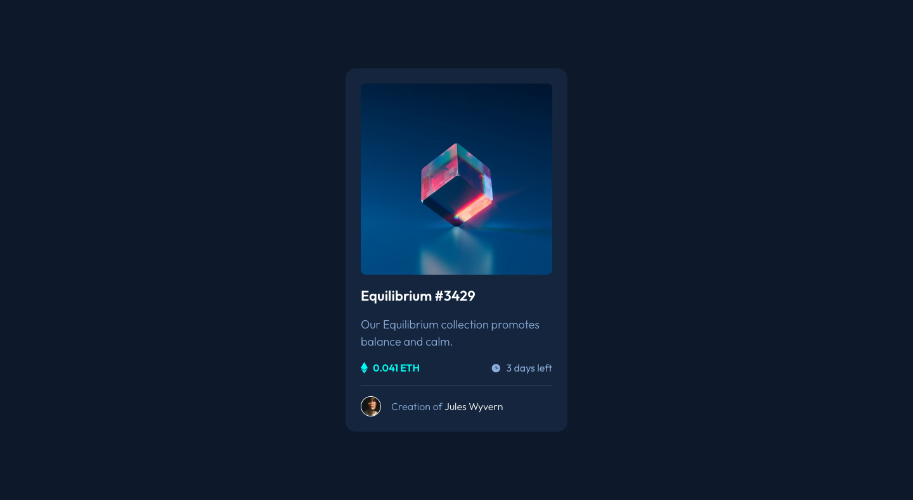

# Frontend Mentor - NFT preview card component solution

This is a solution to the [NFT preview card component challenge on Frontend Mentor](https://www.frontendmentor.io/challenges/nft-preview-card-component-SbdUL_w0U). Frontend Mentor challenges help you improve your coding skills by building realistic projects.

## Table of contents

- [Overview](#overview)
  - [Screenshot](#screenshot)
  - [Links](#links)
- [My process](#my-process)
  - [Built with](#built-with)
  - [What I learned](#what-i-learned)
  - [Useful resources](#useful-resources)
- [Author](#author)

## Overview

### Screenshot

### Links

- Solution URL: [Frontend Mentor solution URL here](https://www.frontendmentor.io/solutions/nft-preview-card-component-sskPdz1h0I)
- Live Site URL: [live site URL](https://pamplito.github.io/NFT-preview-card-component/)

## My process

### Built with

- Semantic HTML5 markup
- CSS custom properties
- Flexbox
- CSS Grid
- Mobile-first workflow
- Clamp for fluid font size

### What I learned

It was the first time that I do a overlay on hover and also my first time using Clamp. I need to pratice both to get it perfectly and also be more creative on with the overlay effect.

### Useful resources

- [CSS Reset from Josh W Comeau](https://www.joshwcomeau.com/css/custom-css-reset/) - This is the CSS reset that I use.
- [Clamp Calculator](https://chrisburnell.com/clamp-calculator/) - This is the clamp calculator that I used for this project.

## Author

- Frontend Mentor - [@pamplito](https://www.frontendmentor.io/profile/pamplito)
